<div align="center">

# **SOUTRIK MUKHERJEE**
### Building AGI-Ready Systems Today

<a href="https://github.com/SoutrikMukherjee"></a>

<p align="center">
<a href="mailto:soutrik.viratech@gmail.com"></a>
<a href="https://linkedin.com/in/soutrik-mukherjee"></a>
<a href="https://calendly.com/soutrik"></a>
</p>

</div>

---

<div align="center">

## **⚡ WHY I'M DIFFERENT**

</div>

<table>
<tr>
<td width="33%" align="center">
<h3>🧠 COGNITIVE ELITE</h3>
<b>IMO Gold Medalist</b><br/>
Top 0.0001% problem solver<br/>
<sub>If I can solve olympiad problems,<br/>I can solve your hardest challenges</sub>
</td>
<td width="33%" align="center">
<h3>🚀 SHIPS TO PRODUCTION</h3>
<b>1000+ Active Users</b><br/>
Not just papers and prototypes<br/>
<sub>Real systems, real impact,<br/>real revenue potential</sub>
</td>
<td width="33%" align="center">
<h3>🔬 RESEARCH → PRODUCT</h3>
<b>3 Published Papers</b><br/>
50+ citations already<br/>
<sub>I bridge cutting-edge theory<br/>with scalable engineering</sub>
</td>
</tr>
</table>

---

## **🎯 FLAGSHIP PROJECTS**
*Click stars ⭐ to support open-source AI/Robotics*

### **[Neural-Network-Compiler-Framework](https://github.com/SoutrikMukherjee/Neural-Network-Compiler-Framework)** ⭐
> **Making AI 10x faster** • C++ • Graph Optimization • MLIR
- Compiles neural networks to optimized machine code
- **30% faster inference** than TensorFlow Lite on edge devices
- Powers real-time robotics applications

### **[Human-Robot Collaboration via Multimodal LLMs](https://github.com/SoutrikMukherjee/human-robot-collaboration-with-multimodal-language-models)** ⭐
> **The future of human-machine interaction** • ROS2 • LLMs • Computer Vision
- Natural language control of robotic systems
- **<100ms latency** for real-time operations
- Featured in robotics conferences

### **[Distributed Control System Architecture](https://github.com/SoutrikMukherjee/Distributed-Control-System-Architecture)** ⭐
> **Industrial-grade distributed systems** • C++ • MPI • Real-time
- **<10ms latency**, **99.99% uptime**
- Handles 1M+ messages/second
- Production-ready for autonomous vehicles

### **[ML Stock Price Predictor](https://github.com/SoutrikMukherjee/ML-Stock-Price-Prediction)** ⭐
> **87% accuracy with sentiment analysis** • LSTM • NLP • Backtesting
- Combines market data with news sentiment
- Full backtesting framework included
- Used by 500+ traders

---

## **💻 TECH MASTERY**

```python
class SoutrikMukherjee:
    def __init__(self):
        self.languages = ["C++", "Python", "TypeScript", "CUDA"]
        self.ml_frameworks = ["PyTorch", "TensorFlow", "JAX", "Triton"]
        self.robotics = ["ROS2", "MoveIt", "Gazebo", "Real-time Control"]
        self.systems = ["Distributed Systems", "Compiler Design", "MLIR", "MPI"]
        self.shipping = ["Docker", "K8s", "CI/CD", "Production ML"]
        
    def current_focus(self):
        return "Building AGI-ready infrastructure for robotics"
        
    def superpower(self):
        return "Turning research papers into production systems in weeks"
```

---

## **📊 IMPACT SCORECARD**

<div align="center">

| **METRIC** | **VALUE** | **WHAT IT MEANS** |
|:---:|:---:|:---|
| **Research Papers** | 3 | IEEE/ACM published, peer-reviewed |
| **GitHub Stars** | 100+ | Top 5% open source contributor |
| **Production Users** | 1,000+ | Real products, not just demos |
| **System Uptime** | 99.99% | Enterprise-grade reliability |
| **Code Coverage** | 95%+ | Quality is non-negotiable |
| **Response Time** | <10ms | Real-time system expertise |

</div>

---

## **🔮 VISION: THE NEXT 5 YEARS**

```mermaid
graph LR
    A[2025: ML Engineer] --> B[2027: Tech Lead]
    B --> C[2029: CTO/Founder]
    C --> D[2030: AGI Infrastructure]
    
    style A fill:#00D9FF
    style B fill:#00A8CC
    style C fill:#007799
    style D fill:#004466
```



**Building the infrastructure for artificial general intelligence.**
- Today: Optimizing neural networks and robotic systems
- Tomorrow: Leading teams building AGI-ready platforms
- 2030: Running critical AI infrastructure used by millions

---

## **🎯 SEEKING: SUMMER 2025 INTERNSHIP**

### **What I Bring Day 1:**
- ✅ Production ML experience (not just Jupyter notebooks)
- ✅ Can optimize your inference by 30%+ 
- ✅ Full-stack + systems programming
- ✅ Published researcher who ships code
- ✅ IMO Gold = I solve problems others can't

### **Ideal Roles:**
`ML Infrastructure` • `Robotics` • `Compiler Engineering` • `AI Systems` • `Autonomous Vehicles`

<div align="center">

### **Let's build the future together.**

<a href="https://calendly.com/soutrik">

</a>

<a href="mailto:soutrik.viratech@gmail.com">

</a>

</div>

---

<div align="center">

### **Recent Activity**

<!--START_SECTION:activity-->
🔭 Working on: **Neural compiler optimizations for 100x faster AI inference**  
🌱 Learning: **Triton for GPU kernel programming**  
💬 Ask me about: **Making ML models actually work in production**  
⚡ Fun fact: **I optimize code like I optimize mechanical systems - obsessively**
<!--END_SECTION:activity-->

<br/>


<br/>

**"First principles thinking + relentless execution = exponential impact"**

<br/>


</div>
