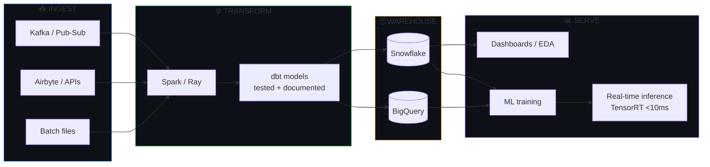

<div align="center">


<br/>

**I build the full data lifecycle — ingestion to insight to inference.**

<br/>

<a href="https://www.soutrikm.com/"></a>
<a href="https://linkedin.com/in/soutrik-mukherjee"></a>
<a href="mailto:soutrik.viratech@gmail.com"></a>
<a href="https://doi.org/10.48550/arXiv.2603.28708"></a>


</div>

---

## `> whoami`

```text
Data + ML engineer with a physics/mechanical foundation.

  ingest → model → serve   :  I own every stage of the pipeline
  schema over chaos        :  tested tables, documented models, data contracts
  metric over vibe         :  numbers in every claim below

Open to: Data Engineer · Data Scientist · Data Analyst · ML Engineer
```

---

## 🔄 How I Think About Data


```mermaid
flowchart LR
    subgraph INGEST["📥 INGEST"]
        A1[Kafka / Pub-Sub]
        A2[Airbyte / APIs]
        A3[Batch files]
    end
    subgraph TRANSFORM["⚙️ TRANSFORM"]
        B1[Spark / Ray]
        B2[dbt models<br/>tested + documented]
    end
    subgraph STORE["🗄️ WAREHOUSE"]
        C1[(Snowflake)]
        C2[(BigQuery)]
    end
    subgraph SERVE["📊 SERVE"]
        D1[Dashboards / EDA]
        D2[ML training]
        D3[Real-time inference<br/>TensorRT &lt;10ms]
    end
    A1 --> B1
    A2 --> B1
    A3 --> B1
    B1 --> B2
    B2 --> C1
    B2 --> C2
    C1 --> D1
    C1 --> D2
    C2 --> D2
    D2 --> D3
    style INGEST fill:#0d1117,stroke:#58a6ff
    style TRANSFORM fill:#0d1117,stroke:#3fb950
    style STORE fill:#0d1117,stroke:#d29922
    style SERVE fill:#0d1117,stroke:#bc8cff
```

```text
   ORCHESTRATION ──────  Airflow · Dagster · Cloud Composer  ──────  (the conductor)
   QUALITY GATES ──────  dbt tests · schema contracts · CI   ──────  (the bouncer)
   OBSERVABILITY ──────  latency profiles · SLOs · lineage   ──────  (the witness)
```

---

## ⚡ Currently

> **AI Fellow @ Handshake AI** — Designing adversarial benchmarks (Project Helix, Project Axis): golden solutions, fail-to-pass test pipelines, and reasoning evals that systematically expose frontier-model failure modes. Eval design is data engineering — sampling, labeling pipelines, and quality control at scale.

> **Recent**: Published [arXiv:2603.28708](https://doi.org/10.48550/arXiv.2603.28708) — GPU-accelerated transformer inference: **64.4× CPU speedup**, **<10ms latency**, **63% memory reduction** across **360+ benchmarked configurations**.

---

## 🚀 Featured Work

<table>
<tr>
<td width="50%" valign="top">

### 🛠️ Compliance ETL Platform
**BlueRidge Compliance Partners · Data Engineering**

Scheduled batch pipeline reconciling thousands of compliance documents per run against client databases.

```text
flow:    docs ──▶ Airflow DAGs ──▶ dbt
         (staging → marts, fully tested)
         ──▶ Snowflake ──▶ analysts

wins:    schema contracts at every layer
         tested, documented, idempotent
```

`Airflow` `dbt` `Snowflake` `SQL` `Python`

</td>
<td width="50%" valign="top">

### 📚 Multi-Agent RAG Pipeline
**BlueRidge · Retrieval Infrastructure**

LangChain-orchestrated retrieval over compliance corpus: FAISS vector search, semantic chunking, reranking, Ray-distributed embeddings.

```text
95%     recall on regulatory queries
70%     end-to-end latency reduction
1000s   of documents ingested
```

`LangChain` `FAISS` `Ray` `AWS` `RAG`

</td>
</tr>
<tr>
<td width="50%" valign="top">

### ⚙️ Distributed Sensor Pipeline
**UPenn GRASP Lab · Big Data Processing**

Multi-sensor pipeline fusing C++ solver outputs with high-frequency streams. Spark + Ray distribution, CUDA parallelization, Docker + K8s on GCP. Plus scikit-learn predictive models for an autonomous excavator.

```text
3.4×      throughput speedup
40%       memory reduction
85%       lower latency
10,000+   GPU-hours saved / year
```

`Spark` `Ray` `CUDA` `K8s` `GCP` `scikit-learn`

</td>
<td width="50%" valign="top">

### 🔥 GPU-Accelerated Inference
**arXiv:2603.28708 · First Author**

TensorRT-optimized BERT-base & GPT-2, FP16/FP32 hybrid precision. Systematic sweep to find the latency/memory Pareto frontier — a 360-point experiment, analyzed like a dataset.

```text
64.4×    CPU speedup
<10ms    end-to-end latency
63%      memory reduction
360+     configs benchmarked
```

`TensorRT` `CUDA` `PyTorch` `Mixed-Precision`

</td>
</tr>
<tr>
<td width="50%" valign="top">

### 🎯 Adversarial LLM Evaluation
**Handshake AI · Projects Helix + Axis**

Benchmarks that surface model failure modes: golden solutions, fail-to-pass test suites, rubric-based pairwise scoring — labeled-data pipelines with QC at every stage.

```text
pipeline:  arXiv → QC → adversarial
           question design → eval
output:    training-quality eval data
```

`LLM Eval` `Benchmark Design` `Docker` `CI`

</td>
<td width="50%" valign="top">

### 🧠 Character-Level LLM Self-Play
**Harrisburg University · Applied DS**

Pre-trained Google's CANINE on a 380k-word corpus with Biased Random Sampling; self-play fine-tuning loop beat human-level performance.

```text
56%    base accuracy (≈ human)
63%    self-play (6 guesses)
87%    self-play (10 guesses)
```

`CANINE` `Self-Play` `RL Fine-tuning` `HF`

</td>
</tr>
</table>

---

## 📐 The Stack, As a Pipeline

```text
 ┌─────────────┐   ┌──────────────┐   ┌──────────────┐   ┌──────────────┐   ┌─────────────┐
 │   SOURCES   │   │   INGEST     │   │  TRANSFORM   │   │  WAREHOUSE   │   │   CONSUME   │
 │             │──▶│ Kafka        │──▶│ Spark · Ray  │──▶│ Snowflake    │──▶│ EDA · Viz   │
 │ APIs · logs │   │ Airbyte      │   │ dbt (tested) │   │ BigQuery     │   │ ML training │
 │ docs · IoT  │   │ Pub/Sub      │   │ Pandas/NumPy │   │ Postgres     │   │ TensorRT    │
 └─────────────┘   └──────────────┘   └──────────────┘   └──────────────┘   └─────────────┘
        ▲                  ▲                  ▲                  ▲                  ▲
        └──────────────────┴────────── Airflow · Dagster ───────┴──────────────────┘
                              Docker · K8s · CI/CD · GCP · AWS
```

#### Languages & Querying


#### Data Engineering


#### Data Science & Analytics


#### ML & LLM Systems


#### Infrastructure


---

## 📊 GitHub Pulse

<div align="center">

<a href="https://github.com/SoutrikMukherjee">
  
  
</a>

<br/><br/>


</div>

---

## 📄 Publications

| | Title | Venue | Domain |
|---|---|---|---|
| **1** | **GPU-Accelerated Optimization of Transformer-Based Neural Networks for Real-Time Inference** | [arXiv:2603.28708](https://doi.org/10.48550/arXiv.2603.28708) | `ML Systems` `GPU` `TensorRT` |
| 2 | Structural Optimization Using Topology Optimization (CNN-driven generative design) | [IJRTE](https://doi.org/10.35940/ijrte.F7462.0712223) | `Deep Learning` `Computational Design` |
| 3 | Bi-Directional Drone Path Planning for Agriculture | [IJRTE](https://doi.org/10.35940/ijrte.B6393.0910321) | `Robotics` `Path Planning` |
| 4 | Automatic Rotating System for Industrial De-scaling | [IJRTE](https://doi.org/10.35940/ijrte.B6395.0910321) | `Systems Design` |

---

## 🎓 Background

<table>
<tr>
<td width="34%" align="center">

**Harrisburg University**
MS Computer Science
*Scientific Computing*

`3.7 / 4.0` · `Mar 2024 – Feb 2026`
🏆 Best Master's Thesis Award

</td>
<td width="33%" align="center">

**UPenn**
MS Mechanical Engineering
*Robotics & Intelligent Systems*

`Aug 2022 – Jan 2024`
GRASP Lab

</td>
<td width="33%" align="center">

**NIT Rourkela**
BTech Industrial Design
*Minor: Mechanical Engineering*

`9.09 / 10` · 🥇 #1 of 120
`Jun 2018 – May 2022`

</td>
</tr>
</table>

<sub>The mechanical engineering foundation isn't filler — pipelines are physical systems with throughput limits, backpressure, and failure modes. I treat data infrastructure the same way.</sub>

---

## 🤝 Beyond the Code

**MANAV** — founded 2019. Teaching math, engineering, and technology to 200+ students across 12+ government schools in India. Bridging what industry needs vs. what school teaches.

---

<div align="center">

### Let's build pipelines that don't break and models that ship.

<a href="mailto:soutrik.viratech@gmail.com">
  
</a>

<br/><br/>


<br/>

<sub><i>"Measure before you ship. The number is the argument."</i></sub>

</div>


